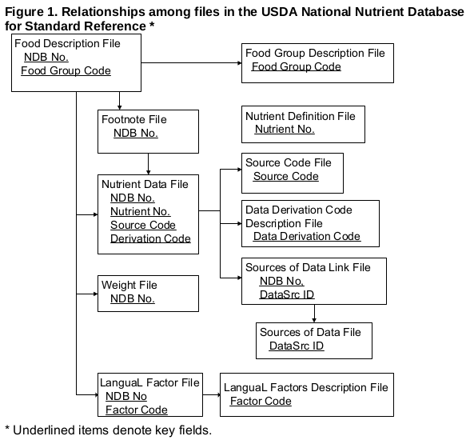

<!-- README.md is generated from README.Rmd. Please edit that file -->

```{r, echo = FALSE}
knitr::opts_chunk$set(
  collapse = TRUE,
  comment = "#>",
  fig.path = "README-"
)

library(pander)
```

This package contains data sets with  the composition of Foods: Raw, Processed, Prepared. The source of the data is the [USDA National Nutrient Database for Standard Reference](http://www.ars.usda.gov/ba/bhnrc/ndl), Release 28 (2015).

There are 12 data sets at the moment. 11 of them work as a relational database where the different data sets link to eachother. You can see how they link to eachother here:



The 12th data set is an abbreviated version of all the data called ABBREV. This is the easiest data set to begin with. And the one I will use in my example.

## Basic nutrient information

```{r, message=FALSE}
# load NutrientData, dplyr and tidyr
library(NutrientData)
library(dplyr)
library(tidyr)
```

Lets first have a look at the the top 20 calorie dense foods

```{r}
data("ABBREV") # Load the data

ABBREV %>% # Select the data
  arrange(-Energ_Kcal) %>% # Sort by calories per 100 g
  select(Food = Shrt_Desc, Calories = Energ_Kcal) %>% # Select relevant columns
  slice(1:20) %>% # Choose the top 20
  pander() # Make the table pretty-ish

```

It's probably no big surprise that oil (pure fat) is the most calorie dense.

But what food contains the highest amount of protein? Lets have a look:

```{r}
ABBREV %>% # Select the data
  arrange(-`Protein_(g)`) %>% # Sort by protein per 100 g
  select(Food = Shrt_Desc, Protein = `Protein_(g)`) %>% # Select relevant columns
  slice(1:20) %>% # Choose the top 20
  pander() # Make the table pretty-ish

```

Here we see that soy, eggwhites and pork skins are good sources of protein. Dig in!

Lets have a look at those pork skins and see what nutrients they contain:

```{r}
ABBREV %>% # Select the data
  filter(Shrt_Desc == "PORK SKINS,PLAIN") %>% # Select the pork skins
  select(-1:-2) %>% # Remove name and number
  gather(Nutrients, Per_100_g) %>% # Turn into long format
  pander() # Make the table pretty-ish
```

## Lookup and calculations

I have included a few functions to help do basic search and some nutrient calculations.
The first one is `search_ingredient()`, which searches the `ABBREV` data based on one or more search strings.

Lets search for onion:

```{r}
search_ingredient("onion")
```

As you can see, it returns all foods where it detects the word "onion". It's a bit too many. If you feed the function more words seperated by commas, it only returns the ones where all words match. Lets look for raw onions:

```{r}
search_ingredient("onion,raw")
```

Much better. Only four results. We can know take the exact string of raw onions and feed it to the nutrient calculator, along with some cabbage and som mayonnaise.

In addition to telling it what foods we want to include in our calculations we also need to tell it how many grams we have of each. 

```{r}
ingredients <- c("CABBAGE,RAW", "MAYONNAISE,RED FAT,W/ OLIVE OIL", "ONIONS,RAW")
grams <- c(100, 20, 10)

calculate_nutrients(ingredients, grams) %>% 
  select(Food = 1, Calories = 3, Protein = 4,
         Fat = 5, Carbs = 7) %>% # Select only a few variables for looks and rename
  pander() # Make the table pretty-ish
```

So our little cabbage salad has a total of 101 calories coming mostly from the mayonnaise.
